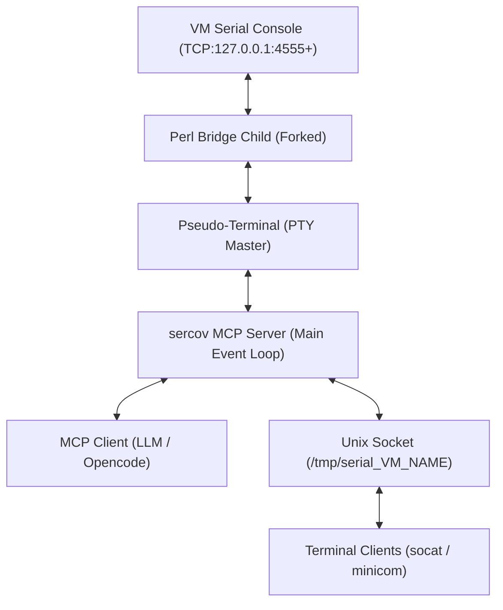

# SERCOV - The SERial COnsole to Vm MCP Server Usage Guide

(tested with QEMU/KVM/virt-manager and OpenCode)

## Overview

The `sercov.pl` script provides a standard MCP (Model Context Protocol) 1.0 server for bidirectional communication with VM serial consoles via an internal Perl-based socket bridge.

It uses `IO::Pty` to create a pseudo-terminal (PTY) for the VM serial console. It manages multiple VMs by assigning unique TCP ports for communication and provides a high-performance multiplexed event loop.

### Core Features:
- **Persistent PTY**: Maintains a stable connection to the VM serial console.
- **Auto-Restart**: Automatically detects VM disconnects and restarts the bridge for persistent interaction.
- **Ring Buffer**: Maintains a ring buffer of the last 500 lines of output.
- **Multi-Client Access**: Supports multiple simultaneous clients via a Unix socket at `/tmp/serial_${VM_NAME}`.
- **Standard MCP**: Supports standard `tools/list` and `tools/call` methods for tool discovery and execution.
- **Zombie Management**: Built-in process reaper prevents zombie processes from forks.

## Prerequisites
- Perl with `IO::Pty` and `JSON::PP` modules installed.
- VM running with serial console on a TCP port (default starts at 4555).
- It does not require root permissions.
- It does not require having socat/minicom installed (these are optional).

## Configuration

Make sure the MCP server is configured in `opencode.jsonc`:
```json
"mcp": {
    "sercov": {
        "type": "local",
        "command": ["perl", "/path/to/sercov.pl"],
        "enabled": true
    }
}
```

**Make sure your guest OS is configured to use the serial console.**

GRUB example:

```bash
GRUB_CMDLINE_LINUX_DEFAULT="console=ttyS0,115200n8"
```
/etc/inittab example:

```bash
T0:23:respawn:/sbin/getty -L ttyS0 115200 vt100
```
systemd example:

```bash
systemctl enable serial-getty@ttyS0.service
systemctl start serial-getty@ttyS0.service
```

QEMU/KVM example XML config:

```xml
<serial type="tcp">
  <source mode="bind" host="127.0.0.1" service="4555" tls="no"/>
  <protocol type="raw"/>
  <target type="isa-serial" port="0">
    <model name="isa-serial"/>
  </target>
  <alias name="serial0"/>
</serial>
```

## Standard MCP Methods

### `tools/list`
Lists all available tools.
- **Request**: `{"jsonrpc": "2.0", "id": 1, "method": "tools/list"}`
- **Response**: List of tools with their input schemas.

### `tools/call`
Executes a specific tool.
- **Request Format**:
  ```json
  {
    "jsonrpc": "2.0",
    "id": 1,
    "method": "tools/call",
    "params": {
      "name": "tool_name",
      "arguments": { ... }
    }
  }
  ```

## Available Tools

### 1. `start`
Starts the bridge for a specific VM. If a bridge already exists, it is restarted to ensure a **clean slate**.
- **Arguments**: `{"VM_NAME": "string", "PORT": "number"}` (PORT is optional, default: 4555)
- **Example**: `tools/call {"name": "start", "arguments": {"VM_NAME": "BEEMO_VM", "PORT": 4555}}`

### 2. `status`
Checks the status of the bridge.
- **Arguments**: `{"VM_NAME": "string"}`
- **Returns**: Running status, port, and buffer size.

### 3. `read`
Reads the last 100 lines from the VM serial console ring buffer.
- **Arguments**: `{"VM_NAME": "string"}`
- **Returns**: `{"success": true, "output": "..."}`

### 4. `write`
Sends a command to the VM serial console.
- **Arguments**: `{"VM_NAME": "string", "text": "command"}`

### 5. `stop`
Stops the bridge for a specific VM.
- **Arguments**: `{"VM_NAME": "string"}`

## Architecture



The parent MCP server uses `IO::Select` to multiplex:
1. `STDIN`: JSON-RPC commands from the LLM or Opencode.
2. `PTY Master`: Real-time data from/to the VM via the child bridge.
3. `Unix Socket`: Listener for external terminal connections.
4. `Unix Clients`: Active terminal sessions connected to the Unix socket.

When the VM disconnects, the parent detects the PTY closure and automatically restarts the bridge child to maintain persistence.

### Terminal Access
For direct interaction outside of the MCP environment, you can connect to the Unix socket:
```bash
socat - UNIX-CONNECT:/tmp/serial_BEEMO_VM
```
New connections automatically receive the last 50 lines of history.

## Troubleshooting
- **Failed to get tools**: Ensure the script is run in an environment where standard input/output is captured. Use `tools/list` to verify connectivity.
- **Bridge not running**: Call `start` before attempting to read or write.
- **Socket Permission**: Ensure `/tmp` is writable by the user running the MCP server.
- **Syntax Check**: Run `perl -c sercov.pl` to verify script integrity.
