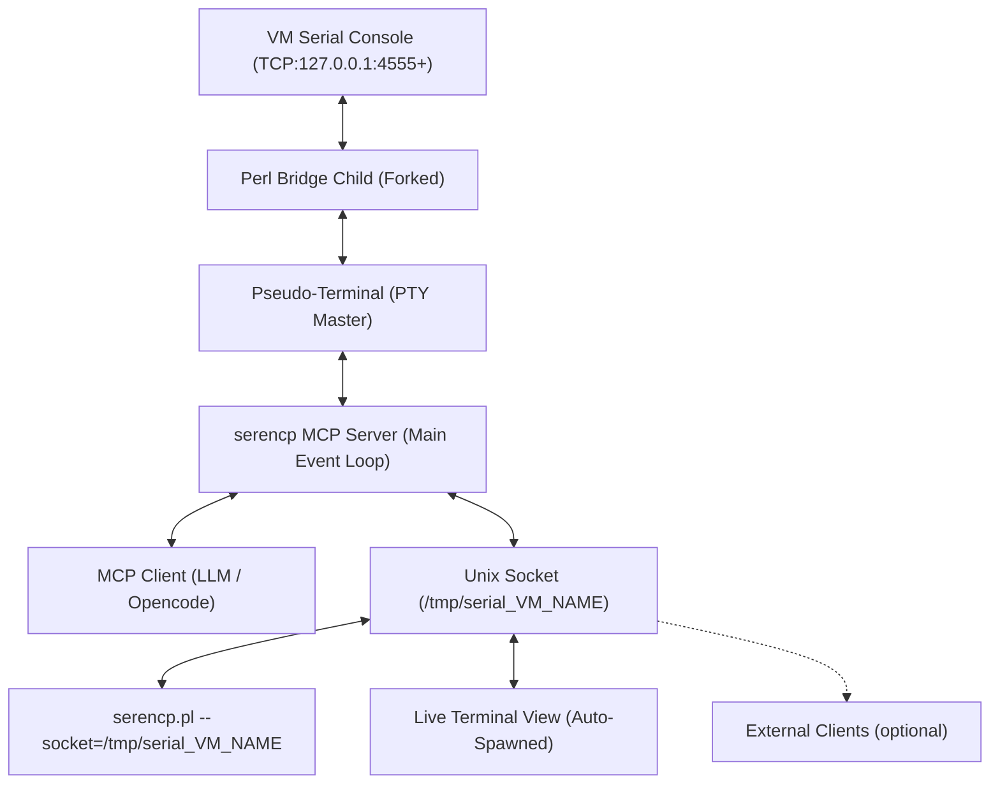
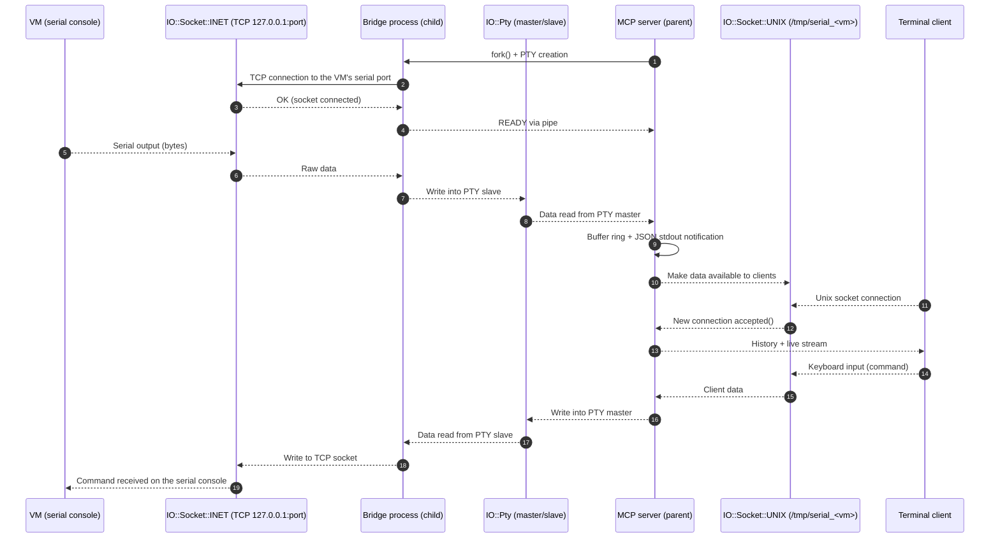

# SERENCP - VM Console MCP Server & live viewer Usage Guide

(tested with QEMU/KVM/virt-manager and OpenCode)

## Overview

The `serencp.pl` script provides a standard MCP (Model Context Protocol) 1.0 server for bidirectional communication with VM serial consoles via an internal Perl-based socket bridge.

It uses `IO::Pty` to create a pseudo-terminal (PTY) for the VM serial console. It manages multiple VMs by assigning unique TCP ports for communication and provides a high-performance multiplexed event loop.

### Core Features:
- **Persistent PTY**: Maintains a stable connection to the VM serial console.
- **Auto-Restart**: Automatically detects VM disconnects and restarts the bridge for persistent interaction.
- **Ring Buffer**: Maintains a ring buffer of the last 1000 lines of output (10MB max per VM).
- **Multi-Client Access**: Supports multiple simultaneous clients via a Unix socket at `/tmp/serial_${VM_NAME}`.
- **Standard MCP**: Supports standard `tools/list` and `tools/call` methods for tool discovery and execution.
- **Zombie Management**: Built-in process reaper prevents zombie processes from forks.

## Prerequisites
- **Operating System**: Strictly requires a *nix-like system (Linux, macOS, BSD, etc.). Windows is NOT supported (unless via WSL).
- Perl with `IO::Pty` and `JSON::PP` modules installed.
- VM running with serial console on a TCP port (default starts at 4555).
- It does not require root permissions.
- **Automatic Terminal Feature**: Requires a supported terminal emulator to automatically spawn a window. It uses an internal client mode and does **not** require `socat`.

### Supported Terminal Emulators

The script automatically detects and supports the following terminal emulators:

**Linux/Unix:**
- `konsole` (KDE)
- `gnome-terminal` (GNOME)
- `xterm` (classic X11 terminal)
- `terminator` (advanced tiling terminal)
- `guake` (drop-down terminal)
- `tilix` (GTK3 tiling terminal)
- `alacritty` (GPU-accelerated terminal)
- `kitty` (GPU-accelerated terminal)
- `urxvt` (Unicode rxvt)
- `xfce4-terminal` (XFCE desktop)
- `lxterminal` (LXDE desktop)
- `deepin-terminal` (Deepin desktop)
- `mate-terminal` (MATE desktop)
- `qterminal` (LXQt desktop)
- `wezterm` (cross-platform terminal)
- `ghostty` (modern GPU-accelerated terminal)

**macOS:**
- `Terminal.app` (built-in macOS terminal)
- `iTerm.app` (iTerm2)

The script will automatically detect which terminal is available on your system and use the appropriate command-line arguments to spawn a new terminal window connected to the VM serial console session. If no terminal is detected, it provides fallback mechanisms and error notifications.

## Configuration

### Default Constants
- **Default VM Port**: 4555
- **Ring Buffer Size**: 1000 lines
- **Max Buffer Bytes**: 10MB per VM
- **Console History Lines**: 60 lines (sent to new clients)
- **Read Timeout**: 20 seconds (for read tool)

### MCP Server Configuration
Make sure the MCP server is configured in `opencode.jsonc`:
```json
"mcp": {
    "serencp": {
        "type": "local",
        "command": ["perl", "/path/to/serencp.pl"],
        "enabled": true
    }
}
```

**Make sure your guest OS is configured to use the serial console.**

GRUB example:

```bash
GRUB_CMDLINE_LINUX_DEFAULT="console=ttyS0,115200n8"
```
/etc/inittab example:

```bash
T0:23:respawn:/sbin/getty -L ttyS0 115200 vt100
```
systemd example:

```bash
systemctl enable serial-getty@ttyS0.service
systemctl start serial-getty@ttyS0.service
```

QEMU/KVM example XML config:

```xml
<serial type="tcp">
  <source mode="bind" host="127.0.0.1" service="4555" tls="no"/>
  <protocol type="raw"/>
  <target type="isa-serial" port="0">
    <model name="isa-serial"/>
  </target>
  <alias name="serial0"/>
</serial>
```

## Standard MCP Methods

### `tools/list`
Lists all available tools.
- **Request**: `{"jsonrpc": "2.0", "id": 1, "method": "tools/list"}`
- **Response**: List of tools with their input schemas.

### `tools/call`
Executes a specific tool.
- **Request Format**:
  ```json
  {
    "jsonrpc": "2.0",
    "id": 1,
    "method": "tools/call",
    "params": {
      "name": "tool_name",
      "arguments": { ... }
    }
  }
  ```

## Live Output Notifications

The server now supports real-time VM output streaming through MCP protocol notifications. This provides immediate feedback without requiring polling.

### Notification Format
VM output is automatically streamed as JSON-RPC 2.0 notifications:

```json
{
    "jsonrpc": "2.0",
    "method": "notifications/message",
    "params": {
        "level": "info",
        "logger": "vm",
        "data": {
            "vm": "vm1",
            "stream": "stdout",
            "chunk": "output data here",
            "timestamp": "2026-01-01T08:45:23.000Z"
        }
    }
}
```

### Notification Parameters
- **vm**: Name of the VM generating the output
- **stream**: Stream type ("stdout" or "stderr")
- **chunk**: The actual output data chunk
- **timestamp**: ISO 8601 timestamp when the chunk was received

### Client-Side Handling
MCP clients can listen for notifications:

```javascript
client.on('notification', (notification) => {
    if (notification.method === 'notifications/message' && notification.params.logger === 'vm') {
        const { vm, stream, chunk, timestamp } = notification.params.data;
        console.log(`[${timestamp}] ${vm} (${stream}): ${chunk}`);
        // Render live output to UI
    }
});
```

### Benefits
- **Real-time Feedback**: VM output appears immediately without polling
- **Efficient**: Push-based model reduces overhead compared to polling
- **Timestamped**: Each chunk includes precise timing information
- **Backward Compatible**: Existing `read` tool continues to work for pull-based access

### `notifications/message`
The server sends all log messages for errors, warnings, debug info (if enabled), and VM output using the standardized MCP logging notification.

```json
{
    "jsonrpc": "2.0",
    "method": "notifications/message",
    "params": {
        "level": "error", // or "info", "debug"
        "logger": "serencp", // or "vm" for VM output
        "data": {
            "message": "Description of the event",
            "timestamp": "2026-01-01T08:45:23.000Z",
            "vm_name": "vm1" // Optional, if related to a specific VM
        }
    }
}
```

## Available Tools

### 1. `start`
Starts the bridge for a specific VM. If a bridge already exists, it is restarted to ensure a **clean slate**.
**New behavior**: Automatically spawns a graphical terminal window linked to the session using the internal client of `serencp.pl`.
- **Arguments**: `{"vm_name": "string", "port": "number"}` (port is optional, default: 4555)
- **Returns**: `{"success": true, "message": "...", "port": 4555, "socket": "/tmp/...", "session_id": "session_..."}`
- **Example**: `tools/call {"name": "start", "arguments": {"vm_name": "MYVM", "port": 4555}}`

### 2. `status`
Checks the status of the bridge.
- **Arguments**: `{"vm_name": "string"}`
- **Returns**: `{"running": true/false, "vm_name": "...", "port": ..., "buffer_size": ...}`

### 3. `read`
Reads output from VM serial console with a 20-second timeout. Returns the last 60 lines from the ring buffer.
- **Arguments**: `{"vm_name": "string"}`
- **Returns**: `{"success": true, "output": "..."}`

### 4. `write`
Sends a command to the VM serial console.
- **Arguments**: `{"vm_name": "string", "text": "command"}`

### 5. `stop`
Stops the bridge for a specific VM.
- **Arguments**: `{"vm_name": "string"}`

## Architecture

The script connects to the VM serial console as a client and provides a Unix socket server at `/tmp/serial_VM_NAME`. It supports both an internal Unix socket client mode and automatic terminal spawning. The MCP server handles JSON-RPC commands and replies via MCP-compliant notifications.

### Internal Unix Socket Client Mode
The script can be run in client mode to connect to an existing bridge:
```bash
./serencp.pl --socket=/tmp/serial_VM_NAME
```

This mode provides direct terminal access to the VM serial console through the Unix socket interface.



The parent MCP server uses `IO::Select` to multiplex:
1. `STDIN`: JSON-RPC commands from the LLM or Opencode.
2. `PTY Master`: Real-time data from/to the VM via the child bridge.
3. `Unix Socket`: Listener for external terminal connections.
4. `Unix Clients`: Active terminal sessions connected to the Unix socket.

When the VM disconnects, the parent detects the PTY closure and automatically restarts the bridge child to maintain persistence.

## Sequence Diagram



### Terminal Access
For direct interaction outside of the MCP environment, you can use the script itself as a client:
```bash
./serencp.pl --socket=/tmp/serial_MYVM
```
New connections automatically receive the last 60 lines of history. Live output notifications are sent automatically when VM data is received, providing real-time streaming without polling.

## Troubleshooting
- **Failed to get tools**: Ensure the script is run in an environment where standard input/output is captured. Use `tools/list` to verify connectivity.
- **Bridge not running**: Call `start` before attempting to read or write.
- **No live notifications**: Ensure your MCP client supports notification handling. Notifications are sent automatically when VM output is received.
- **Socket Permission**: Ensure `/tmp` is writable by the user running the MCP server.
- **Syntax Check**: Run `perl -c serencp.pl` to verify script integrity.

## About

The name `serencp` is a play on words:
- `seren` - Serenity / Serial
- `cp` - MCP (Model Context Protocol)
